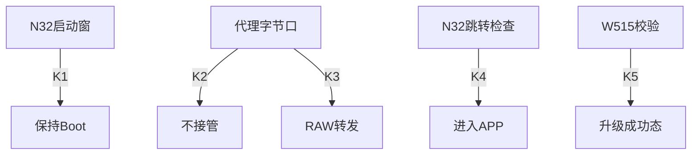

# 当前 J57AA 固件 OTA 协议与证据

> 本文依据当前固件源码和实际 Keil 编译入口，不以旧上位机文档作为固件实现的证明。源码根目录为 `E:\tof\qiangmiao\data\J57AACode_20260507\J57AACode_20260507`，目录日期不代表当前源码版本。未连接或刷写真机，未证明设备已安装镜像与源码一致。
> 浏览器操作、完整16种镜像组合和失败处理见 [升级指南](UPGRADE_GUIDE.md)。当前网页只开放 W515 APP 刷写，N32 只检测状态。

## 1. 先区分四种证据

| 维度 | 主控运行模式 | 副板运行模式 | 代理状态 | 镜像有效性 |
|---|---|---|---|---|
| 直接证据 | **01自身应答** | **31自身应答** | **GLPX应答** | **对应检查结果** |
| F7能否证明 | **不能** | 同上 | 同上 | 同上 |
| 无响应结论 | **未确认** | 同上 | 同上 | 同上 |
| 查询对象 | **W515** | **N32** | **W515代理** | **Flash内容** |

共性：版本号或通路状态不能代替检查。
关键差异：主控Boot无代理不等于副板空白。

## 2. 编译入口与源码定位

下列别名均相对上述源码根目录；行号对应本次只读检查时的文件。

- `WA`：`MCU_Master_W515PIQ6_APP/BSP/boot_sdk/app_upgrade/upgrade_service.c`。
- `PX`：同目录 `upgrade_proxy.c`。
- `RT`：`MCU_Master_W515PIQ6_APP/BSP/src/bsp_rangefinder.c`。
- `BP`：同目录 `bsp_ble_protocol.c`。
- `IRQ`：`MCU_Master_W515PIQ6_APP/Template/gd32w51x_it.c`。
- `WB`：`MCU_Master_W515PIQ6_IAP/Template/boot_sdk_w515/Core/Src/bootloader.c`。
- `WM`：同目录 `main.c`；`WP`：同目录 `protocol.c`。
- `WC`：`MCU_Master_W515PIQ6_IAP/Template/boot_sdk_w515/product_config.h`。
- `NA`：`MCU_Slave/SeerLib/SystemAPI/MiniModule_SystemConfig.c`。
- `NI`：`MCU_Slave/SeerLib/Src/n32g430_it.c`。
- `NB`：`MCU_Slave_Boot_N32/src/main.c`。

| 维度 | W515 APP | W515 Boot | N32 APP | N32 Boot |
|---|---|---|---|---|
| 编译主体 | **WA/PX/RT** | **WM/WB/WP** | **NA/NI** | **NB** |
| 自身模式应答 | **AA55AA55** | **87654321** | **N32A** | **N32B** |
| F7信息 | **支持** | 同上 | **不适用** | 同上 |
| N32代理 | **PX已编译** | **未编译** | **被代理目标** | 同上 |
| APP入Boot | **03** | **已在Boot** | **38+N32A** | **已在Boot** |
| 本次网页写入 | **转Boot写APP** | **直接写APP** | **不实现** | 同上 |

共性：命令常量存在不等于分支实现。
关键差异：N32应答前缀有状态字节。

编译证据：主控 APP 的 `Template/Keil_Project/Project.uvprojx:340,389,474,489-519` 包含 IRQ、RT、BP、WA、PX 和对应 port。主控 IAP 的同名工程 `:382-486` 编译 WM、WB、WP、boot_comm、CMSIS、外设和启动文件，无 PX；WB 实际分派 `:955-1319` 也没有 GLPX/N32 代理处理。主控 APP 的默认 `APP_BLE_RX_DISPATCH_IN_MAIN=1`、`APP_ENABLE_N32_BOOT_DIRECT_TEST=0` 来自其 `BSP/boot_sdk/product_config.h:100-122`，不要把调试直通当作默认能力。N32 APP 工程 `Keil_project/SP56622-Coaxial-N32G430.uvprojx:341,459,474,519` 编译实际主循环、NI 和 NA；N32 Boot 工程 `Keil_project/Range_N32_Boot.uvprojx:341` 未覆盖为串口回环调试宏。

## 3. 查询与升级的关键判定

### 条件字典

原文表达式保留完整标识符，不能缩写成另一条逻辑。下图是四个独立入口的关键成功分支，不是它们依次执行；K3仅在K2不成立后判定，K5仅在 `calculated_crc == verify_crc`（WB:1210）成立后判定。其余分支按转移矩阵和原始函数处理。

| 标签 | 判什么 | 判定式 | 代码位置 |
|---|---|---|---|
| K1 | N32收到整帧 | `r == 1` | NB:1498 |
| K2 | 代理尚未激活 | `!g_proxy.active` | PX:1197 |
| K3 | 代理字节口为RAW | `proxy_mode_is_raw(g_proxy.mode)` | PX:1203 |
| K4 | N32可跳APP | `app_valid()` | NB:1400 |
| K5 | 主控元数据一致 | `ok` | WB:1222 |

### 转移矩阵

| 判定场景 | N32启动窗口 | 代理字节入口 | N32进APP | W515校验 |
|---|---|---|---|---|
| K1成立 | **→保持Boot** | — | — | — |
| K2成立 | — | **→不接管** | — | — |
| K2否且K3成立 | — | **→RAW转发** | — | — |
| K4成立 | — | — | **→跳APP** | — |
| K4不成立 | — | — | **→错误应答** | — |
| K5成立 | — | — | — | **→升级成功态** |
| K5不成立 | — | — | — | **→元数据失败** |



### 代码证据

K1 NB:1498-1500
```cpp
if (r == 1) {
    /* 接收到有效命令，停留在 Bootloader */
    stay_boot = 1U;
```
K2 PX:1197-1199
```cpp
if (!g_proxy.active) {
    return false;
}
```
K3 PX:1203-1205
```cpp
if (proxy_mode_is_raw(g_proxy.mode)) {
    proxy_raw_forward_ble_byte(byte);
    return true;
```
K4 NB:1400-1402
```cpp
if (app_valid()) {
    send_response(CMD_ENTER_APP, ST_OK, 0, 0);
    uart_wait_tx_done();
```
K5 WB:1222-1224
```cpp
if (ok) {
    s_state = STATE_UPGRADE_SUCCESS;
    RTC_BKP10 = UPGRADE_W515_APP_MAGIC;
```

## 4. 帧格式必须先分流

所有偏移均为0起始。CRC16-Modbus：初值FFFF、多项式A001；CRC字节在线上均高字节在前。

| 维度 | W515 OTA | N32 OTA | GLPX控制 | F7信息 |
|---|---|---|---|---|
| 起始 | AA | 同上 | 同上 | 同上 |
| LEN | **BE16** | 同上 | 同上 | **响应固定30h** |
| 校验 | **CRC16** | 同上 | 同上 | **XOR** |
| 校验覆盖 | **CMD起** | 同上 | **AA起** | **F7起** |
| 结束 | **55** | 同上 | **无尾标记** | **BB FF** |
| 响应状态前缀 | **命令相关** | **必有1字节** | **GLPX后1字节** | **无** |

共性：校验、长度与边界同时验证。
关键差异：不能用一个magic猜全部协议。

### W515/N32帧

```text
AA CMD LEN_H LEN_L PAYLOAD... CRC_H CRC_L 55
CRC范围 = CMD + LEN_H + LEN_L + PAYLOAD
响应CMD = 请求CMD | 80h
```

主控握手请求的已核算样本：`AA 01 00 04 12 34 56 78 34 81 55`。旧例子 `31 C3` 错误。W515响应payload恰4字节模式magic，不带状态前缀；WA:100-109、WB:956-977。N32响应payload第0字节是status，后面才是magic/信息；NA:147-165、NB:923-950。

### F7

请求：`AA EE F7 00 00 00 00 F7 BB FF`。RT:173-201还接受请求第7字节00；WP:165-179按固定F7模式解析，网页使用两边共同接受的F7版本。

响应：`AA FE F7 30 [info48] XOR BB FF`，全长55；XOR覆盖帧偏移2..51，存52。WA与WB都支持，因此F7不能判断APP/Boot。字段构造证据为 IRQ:397-446 和 WB:467-501。

info48是LE：`device_id@0/u32`、`hw@4/u16`、`sw@6/u16`、`boot@8/u16`、保留@10、`model@12/16B`、`flash_size@28/u32`、`app_start@32/u32`、`app_max@36/u32`、`app_size@40/u32`、`app_crc@44/u32`。GET_INFO也返回此结构；WA:112-156、WB:405-434/980-984。APP上报Boot版本来自编译常量，不是读回校验Boot镜像。sw只含Major.Minor，不含完整build/patch。

### GLPX与GLPE

```text
请求：AA 7E LEN16 "GLPX" MODE SESSION32 BAUD32 IDLE32 TOTAL32 [FLAGS8] CRC16
应答：AA 7E 00 05 "GLPX" STATUS CRC_H CRC_L
事件：AA FE LEN16 "GLPE" EVENT SEQ16 CMD STATUS VALUE32 [MIRROR...] CRC16
```

GLPX所有32位参数为BE，MODE为01启动/02停止/03状态/04保活。所有操作均保留完整参数块，最短27字节；启动可选flags后为28字节。SESSION在请求偏移9、BAUD13、IDLE17、TOTAL21、FLAGS25。target不是线上字段，PX:1590直接指定02。PX:1034-1055要求停止/状态/保活也至少27字节。

GLPX应答仅11字节；status在8，9/10是CRC，无MODE或SESSION回显（PX:1385-1401）。status：00活动且会话匹配，01坏帧，03忙，04会话不符，05未激活，07不支持。START的00表示成功启用代理，不表示N32在线。

GLPE是事件而非控制ACK；PX:1404-1422普通事件19字节，:1432起可镜像N32回包。接收器必须把外层事件整体消费，不能从其内部重新搜出B1当成本次新应答；分片跨请求时也必须保留外层所有权。

## 5. 当前代理入口的真实限制

| 维度 | 未激活的APP入口 | NORMAL代理字节口 | RAW代理字节口 |
|---|---|---|---|
| 控制帧收集 | **要求完整块** | **可跨字节收集** | **逐字节原样发** |
| N32查询通路 | **默认无直通** | **可转发31** | **原样转发** |
| flags | **尚未启用** | **00** | **02或08** |
| 网页状态检测 | **整帧查状态** | **采用此模式** | **不采用** |

共性：GATT写成功不等于MCU收到整帧。
关键差异：上层分派可先截获完整GLPX。

RT:309-318顺序为F7、W515升级、完整GLPX控制、活动代理数据、可选N32调试直通、普通业务。完整GLPX在RAW数据入口之前可能已被处理，故“RAW任何时候绝不接受STOP”也不准确。仅当字节进入PX:1203-1205的RAW分支时才无条件转发，不能假设任意分片的STOP都会被主控拦截。

未激活时RT:231-238要求 `len >= expected_len`，IRQ:503-509/663-669按UART IDLE提交块，RT:1727-1750取出后清零。网页不能把27字节GLPX人为切成20+7再假设自动重组；采用一次27字节写入，仍需确认模块实际UART呈现和GLPX应答。浏览器无法读取/协商ATT MTU，这是待真机验证项。

NORMAL下PX:1213-1223收集控制/N32帧，UART回传PX:1278-1286按字节透传并记录诊断。检测使用115200、空闲5000ms、总12000ms；不抢占已有非零会话。退出证据是状态05，不是网页倒计时。PX:1344-1358由固件循环执行超时关闭；循环停滞时无超时保证。GLPX超时会污染当前无序号控制对话，网页锁住后续GLPX直到重新建立GATT连接；不把迟到应答当清理成功。

## 6. 两块板的非擦写状态查询

| 维度 | W515 | N32 APP | N32 Boot |
|---|---|---|---|
| 模式请求 | **01+12345678** | **31+N32B** | 同上 |
| 回包命令 | **81** | **B1** | 同上 |
| payload总长 | **4** | **33** | **17** |
| 模式字节位置 | **payload0..3** | **payload1..4** | 同上 |
| 信息有效性 | **未实测校验** | **当前运行证据** | **仅向量布尔值** |
| 查询副作用 | **Boot连接态改变** | **接收计数变化** | **保持Boot** |

共性：不发进Boot、擦除、写入或复位。
关键差异：查询不是“完全无副作用”。

N32 APP：去掉status后的data32结构来自NA:125-165，magic@0、APP版本BE16@4、保留16@6、APP入口BE32@8、保留32@12、运行阶段@16、RX标志@17、RX计数BE16@18、UART累计BE32@20、弹道收到/处理/有效计数BE16@24/26/28、心跳低16位@30。NA:195-213验证31的N32B；38+N32A才调用Boot跳转，不可用38查询原始状态。NI:201-224体现AA控制/传统帧逐字节互斥所有权。

N32 Boot：去掉status后的data16来自NB:1131-1139，N32B@0、Boot版本8位@4、APP起址BE32@5、APP末址BE32@9、页大小BE16@13、向量有效布尔@15。NB:446-450只检查SP范围、PC范围、Thumb位，不算整包CRC。NB:1470-1478先以RTC标志或无效APP决定停留；接收成功/错误帧的分支:1498-1513均可保持Boot。窗口内被查询后可能不再自动跳APP；网页明确提示，不自动发37补救。

W515 Boot握手会设置 `s_state = STATE_CONNECTED`（WB:972），因此VERIFY成功与RESET之间不可再握手。F7/GET_INFO中的APP大小CRC只是元数据读数（WB:422-432），不是新一次整包有效性检测。主控在Boot时，当前编译版本没有副板代理，网页标记副板通路不可达，不发送N32探测假装有通路。

## 7. W515 APP写入合同

当前产品：Flash `08000000..081FFFFF`，2MiB；Boot32KiB；APP起址 `08008000`；APP最大 `001F8000`=2064384字节；页4096。来源WC:28-34及共享flash_layout派生宏，网页以当前设备与Boot上报窗口交叉核对，不使用旧16KiB Boot地址。

元数据位于APP+0200，64字节：FIRM=`4649524D` LE32@0、version@4、hw@8、build@0C、model16@10、size@20、CRC@24。CRC32兼容算法把镜像偏移0220..0227当FF参与计算；不是整文件CRC32。元数据和文件长度必须一致；网页拒绝Boot/N32/ENC、错硬件版本、旧入口、CRC保留值、无FIRM及越界镜像。

按时间顺序的实际请求（所有地址/大小/CRC/版本参数BE32）：

1. 双板重新探测并确认代理释放；只有收到明确用户确认才走后续变更操作。
2. 主控APP时发03，等单字节00 ACK，最多6轮确认Boot；已在Boot时不发送APP切换命令。
3. GET_INFO再次核对身份和窗口，随后ERASE04：`ADDR SIZE ENCRYPTED8=00`；SIZE向上取整到4096。等ACK，不自动重发。
4. WRITE05：`ACK_REQUEST8=01 ADDR DATA`；每包40字节数据，尾包保持4字节对齐；GATT分片20字节。WB:1078-1097按长度余数识别ACK前缀，:1132按请求发送ACK。每包等00，每16包和末包查written_size，偏差直接失败。
5. VERIFY06：`ADDR SIZE META_CRC VERSION`，等00；GET_STATUS09诊断必须state20、verify_result01且地址/大小/预期/实际CRC一致；GET_INFO再次核对大小CRC。
6. RESET07等00，再确认APP magic和身份/版本/大小/CRC；缺少APP回应必须失败，不能“成功但未确认”。

GET_STATUS49字节来自WB:1261-1285：state8@0、written BE32@1、ORE@5、verify_result8@9、保留@10..12、verify_count@13、addr@17、size@21、expected@25、calculated@29、meta_magic@33、meta_size@37、meta_crc@41、elapsed@45。不能越过实际payload长度读字段。

WB:1216-1218要求元数据magic/size/CRC与本次VERIFY一致；:1223升级成功态20；:1294起RESET另要求成功态和 `check_app_valid()`。有效性检查:585-614包括向量范围、FIRM、合理size/CRC和整包兼容CRC。网页还加严Thumb/栈对齐/复位入口落在本镜像内。RTC备份标志 `00B1234B/00D1234D/00B5678B/00A1234A/00C1234C` 来自WC:98-104，不是握手magic；共享常量或DEADBEEF名称也不可混用。

## 8. N32后续刷写接口：仅记录，网页未开放

| 维度 | N32 APP入口 | N32 Boot入口 |
|---|---|---|
| 状态请求 | **31+N32B** | 同上 |
| 切入Boot | **38+N32A** | **不需要** |
| 擦写能力 | **无** | **33/34/35** |
| 跳APP | **已运行** | **37+N32B** |
| 复位 | **本次未用** | **36** |
| 诊断 | **31的运行字段** | **39** |

共性：当前浏览器不发送副板变更指令。
关键差异：Boot接收能力须由自身应答证明。

N32窗口 `08002000..0800F7FF`，页0800，UART115200（NB:19-54）。Boot33参数 `N32B ADDR SIZE PAGE16`，检查魔数/范围/对齐后擦除（NB:1168-1218）；34参数 `[ACK8] ADDR DATA`，地址/数据4字节对齐，严格顺序或相同内容的已写重复包（NB:1222-1305）；35参数 `N32B ADDR SIZE CRC32`，对Flash原字节计算CRC，正常范围时返回status+地址/大小/预期/实际共17字节（NB:1308-1352）；37检查向量后跳转（NB:1395-1406）。39返回status+62字节诊断，NB:1142-1165。不能把W515的FIRM兼容CRC规则套到N32。

## 9. 可复核产物与缺口

- `tests/fixtures.mjs` 使用独立参考CRC生成模拟响应，不连接设备。
- `tests/ota.test.mjs`、`tests/ota-boundaries.test.mjs` 覆盖双板组合、状态前缀、分片、事件嵌套、代理占用/超时、取消、窗口/镜像校验、丢ACK和APP未确认。
- `tests/browser-smoke.html` 验证七页导航、视口布局、在线下载门禁和取消查询；iframe CSS视口不等于真机。
- 尚未测过BLE模块UART分包、真实ACK吞吐、软硬切换供电、后台/锁屏与恢复；两板Boot完整性不能由版本字符串推定。
- 无自动断点续写、无CRC候选乱试、无Boot自升级、无N32刷写、无加密升级。
