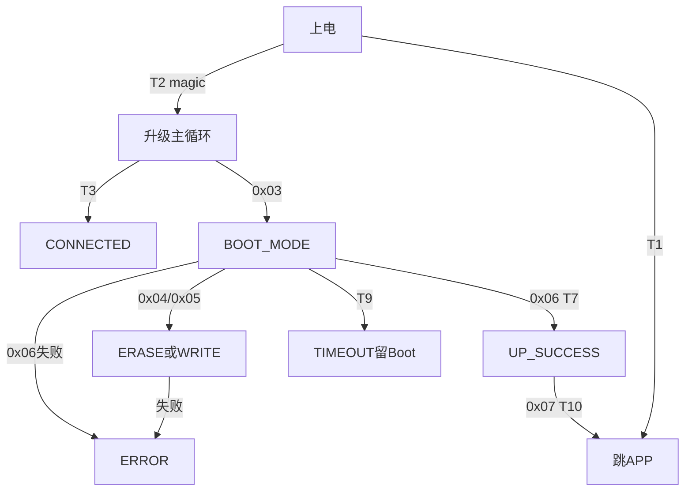

# J57AA OTA 全流程交互说明（场景驱动版）

> 主线：**升级目标 → 检测现状 → 策略选择 → 逐步交互**。全部依据当前固件源码（快照 `J57AACode_20260507/J57AACode_20260507`），带 `文件:行号` 证据；帧格式细节见 [OTA 协议说明](OTA_PROTOCOL_SPEC.md)；所有 hex 帧 CRC 已程序化验证。未连真机，设备镜像与源码一致性未证明。

**文件别名**：WA=upgrade_service.c（主控APP）、WB=bootloader.c（主控Boot）、WP=protocol.c（主控Boot协议）、NA=MiniModule_SystemConfig.c（副板APP）、NB=MCU_Slave_Boot_N32/src/main.c（副板Boot）、PX=upgrade_proxy.c（代理）、RT=bsp_rangefinder.c（主控APP分发）、BP=bsp_ble_protocol.c、IT=gd32w51x_it.c。

## 1. 升级目标（先明确要什么）

| 目标 | 升级对象 | 镜像 | 写入地址窗口 |
|---|---|---|---|
| A | 仅主控 W515 APP | 主控固件 | 0x08008000~0x081FF7FF（WB:680-688） |
| B | 仅副板 N32 APP | 副板固件 | 0x08002000~0x0800F7FF（NB:23-24） |
| C | 双板 | 两个镜像 | 先A后B |

## 2. 检测现状（升级前必做，顺序固定）

### 2.1 检测交互序列

```text
① F7 信息（两模式都回，拿身份/布局，不能判模式）
   发 AA EE F7 00 00 00 00 F7 BB FF
   期 AA FE F7 30 [info48] [XOR] BB FF（55B；APP出口IT:421-446，Boot出口WB:467-502）
   用 device_id/model/app窗口 做固件匹配预检

② W515 握手（判主控模式）
   发 AA 01 00 04 12 34 56 78 34 81 55
   期 APP：AA 81 00 04 AA 55 AA 55 9F F4 55  → 主控=APP
   期 Boot：AA 81 00 04 87 65 43 21 4B B2 55 → 主控=Boot
   无响应 → 模式未知（≠没程序）

③ 仅当主控=APP：经代理查副板（见§2.2）
   主控=Boot → 副板不可达（Boot固件无PX，IAP工程:382-486）
```

⚠️ F7 **不能判模式**：APP 分发表条目1（RT:310,173-202）与 Boot（WB:987-991）都回同样的 55B 帧；模式判定**只能靠 0x01 握手 magic**。

### 2.2 副板检测（仅主控=APP可达，五步）

```text
③a GLPX STATUS（session=0 通配，查代理占用）
    发 AA 7E 00 15 47 4C 50 58 03 00 00 00 00 00 01 C2 00 00 00 13 88 00 00 2E E0 B5 77（27B）
    期 AA 7E 00 05 47 4C 50 58 05 E7 53（status=05 未激活 → 可启动）
    status=00 → 他人会话占用，不抢占（BUSY）
    status=03 → 忙；超时 → 代理状态不明，标记 UNKNOWN
③b GLPX START（session=随机, baud=115200, flags=00/NORMAL）
    发 AA 7E 00 16 47 4C 50 58 01 12 34 56 78 00 01 C2 00 00 00 13 88 00 00 2E E0 00 4F 14（28B）
    期 status=00（01=len/flags错；03=忙）
③c N32 握手（经代理转发到UART1）
    发 AA 31 00 04 4E 33 32 42 75 B8 55
    期 AA B1 00 21 00 4E 33 32 41 ...（magic"N32A"→副板=APP）
    期 AA B1 00 11 00 4E 33 32 42 01 ...（magic"N32B"→副板=Boot）
    无响应 → 副板模式未知（≠没程序）
③d GLPX STOP（自己的session）
    发 AA 7E 00 15 47 4C 50 58 02 12 34 56 78 00*12 2F 36（27B）
    期 status=00（先回后停，PX:1619-1622）
③e GLPX STATUS 再确认
    期 status=05（未激活）→ routeClear；≠05 → CLEANUP_UNCONFIRMED
```

### 2.3 检测结论

检测产出四元组：`{主控模式, 主控info48, 副板模式|不可达, 代理状态}` + routeClear。副板查询可能把已在 Boot 的副板**钉住**（§4.2 窗口规则），属检测副作用，须明知。

## 3. 策略矩阵（目标×状态→路径）

| 目标 | 主控 | 副板 | 路径 | 场景节 |
|---|---|---|---|---|
| A | APP | 任意 | 0x03进Boot→写 | §4.1 |
| A | **Boot** | 不可达 | **直接写** | §4.2 |
| B | **Boot** | 不可达 | **先恢复主控APP**（§4.2路径）再回此表 | §6 |
| B | APP | APP | 0x38进副板Boot→写 | §5.1 |
| B | APP | **Boot** | **直接写副板** | §5.2 |
| C | 任意 | 任意 | **先A后B**：主控完成复位回APP→重新检测→按B路径 | §7 |

依据：主控Boot无代理（IAP工程:382-486）；副板0x33~0x36/0x39仅Boot实现（NA:194-237 default→BAD_CMD）；双板必须先主后副（升副板需主控APP开代理）。

## 4. 场景A：升级主控

### 4.1 主控=APP → 进Boot升级（完整十步）

**条件字典**：

| 标签 | 判什么 | 判定式 | 位置 |
|---|---|---|---|
| T3 | 握手magic正确 | `magic == HANDSHAKE_MAGIC_REQ` | WB:968 |
| T7 | 校验通过 | `calculated_crc == verify_crc` 且 meta三连 | WB:1210-1218 |
| T9 | 30s无活动 | `(get_tick() - last_activity) > 30000U` | WB:885-888 |
| T10 | 可复位交接 | `(s_state == STATE_UPGRADE_SUCCESS) && check_app_valid()` | WB:1295-1296 |

```text
前置：检测通过 + 固件元数据匹配（型号/硬件/窗口/CRC）

① 0x03 请求进Boot
   发 AA 03 00 00 C0 81 55
   期 AA 83 00 01 00 30 28 55
   ⚠️ APP回ACK后直跳Boot（WA:160-164），BLE可能断连→重连
② 等 Boot magic（≤6次，间隔500ms）
   发 AA 01 00 04 12 34 56 78 34 81 55
   期 AA 81 00 04 87 65 43 21 4B B2 55
③ 核对Boot身份
   发 AA 02 00 00 00 D0 55
   期 AA 82 00 30 [info48]；比对 device_id/app_start/app_max 与①前一致（变即停）
④ 擦除（≤120s）
   发 AA 04 00 09 08 00 80 00 [size:4BE] 00 52 A2 55
   期 AA 84 00 01 00 44 29 55
   错 02=len错；03=擦除失败→STATE_ERROR
⑤ 逐包写入（40B/包，带ACK形态，每包等）
   发 AA 05 00 29 01 [addr:4BE] [data:40] CRC 55
   期 AA 85 00 01 00 B8 28 55（丢ACK即停，不自动重发）
⑥ 每16包或末包核对计数
   发 AA 09 00 00 C2 A1 55
   期 AA 89 00 31 ...；written_size≠已确认数→停（WB:1263-1267）
⑦ 校验（≤30s）
   发 AA 06 00 10 [addr:4BE] [size:4BE] [crc32:4BE] [ver:4BE] CRC 55
   期 AA 86 00 01 00 FC 28 55；再查0x09确认state=0x20+诊断一致
⑧ 写后元数据核对
   发 AA 02 00 00 00 D0 55 → app_size/app_crc 与固件meta一致
⑨ 复位（仅升级成功态放行，T10）
   发 AA 07 00 00 01 C0 55
   期 AA 87 00 01 00 00 29 55；未成功→AA 87 00 01 06 02 A9 55拒绝
⑩ 等APP magic + 终检
   发 AA 01 ... → 期 AA 81 00 04 AA 55 AA 55 9F F4 55
   发 AA 02 ... → device_id/app_size/app_crc/sw_ver 匹配 → 完成
```

**Boot 状态机**（升级期间固件侧内部状态）：



### 4.2 主控=Boot → 直接升级

跳过①②（已在Boot）：从③核对身份起走§4.1的③~⑩。副板此时不可达；完成后重新检测副板。

## 5. 场景B：升级副板（前提：主控=APP）

### 5.1 副板=APP → 先0x38进Boot再升级

**N32 Boot 停留条件字典**：

| 标签 | 判什么 | 判定式 | 位置 |
|---|---|---|---|
| M1 | RTC魔术字 | `dbg_boot_magic == BOOT_MAGIC` | NB:1468,1472 |
| M2 | APP向量无效 | `!dbg_app_valid`（SP/PC范围+Thumb位，NB:448-450） | NB:1470 |
| M3 | 收到完整命令帧 | `r == 1` | NB:1498 |
| M4 | 帧超时/超长 | `r == -1` | NB:1503 |
| M5 | CRC/帧尾错 | `r == -2` | NB:1509 |
| M6 | 窗口到期 | `!stay_boot && millis() >= boot_deadline`（5s，NB:54） | NB:1518 |

```text
前置：主控=APP已确认，代理未占用

① GLPX START（同§2.2③b，NORMAL模式）→ 期 status=00
② 0x38 命令副板进Boot
   发 AA 38 00 04 4E 33 32 41 74 61 55（经代理转发）
   期 AA B8 00 05 00 4E 33 32 41 FB 78 55（回显后复位，NA:210-214）
   副板写 BKP10R="N32B"→复位后 stay_boot=1 **永久停留**（M1，NB:468-472）
   ⚠️ 无需抢5秒窗口（magic在），可从容继续
③ 0x31 确认Boot
   发 AA 31 00 04 4E 33 32 42 75 B8 55
   期 AA B1 00 11 00 4E 33 32 42 01 [app起末址] [页大小] [appValid] 49 58 55
④ 0x33 擦除（页2048对齐）
   发 AA 33 00 0E 4E 33 32 42 08 00 20 00 [size:4BE] 08 00 FA 78 55
   期 AA B3 00 01 00 30 27 55
   错 02=len；03=对齐/范围；05=Flash失败
⑤ 0x34 顺序写入（带ACK位，逐包等）
   发 AA 34 00 xx 01 [addr:4BE] [data:N] CRC 55（addr必须=0x08002000+written_size，NB:1257-1258）
   期 AA B4 00 01 00 44 26 55
   ⚠️ 不带ACK位的成功写入**不回帧**（NB:1303-1305）——所以必须带ACK位
   重复写（内容匹配）→ 仅计数不回帧；跳写→03；覆写非空白→05
⑥ 0x35 校验
   发 AA 35 00 10 4E 33 32 42 [addr:4BE] [size:4BE] [crc32:4BE] E2 61 55
   期 AA B5 00 11 00 [addr] [size] [期望crc] [实算crc] CB DA 55（带16B诊断）
   status=06 → CRC不符
⑦ 0x37 进APP
   发 AA 37 00 00 0E C0 55
   期 AA B7 00 01 00 00 26 55（appValid才放行；无效→03）
⑧ 0x31 确认回APP
   期 AA B1 00 21 00 4E 33 32 41 ...（magic回到"N32A"）
⑨ GLPX STOP → STATUS 确认 05（同§2.2③d③e）
```

⚠️ **不要用 0x36 复位替代 0x37**：0x36 不清 BKP10R 的 "N32B" magic（NB:461-465），复位后副板**仍停留 Boot**；只有 0x37 的 jump_to_app 才清 magic 回 APP（NB:478）。

### 5.2 副板=Boot → 直接升级

跳过②（已在Boot）：从③起走§5.1的③~⑨。

⚠️ **副板Boot可能是被检测钉住的**：若副板自然上电进Boot（无magic、APP有效），5秒窗口（M6）内收到检测的 0x31 即 stay_boot=1 永久停留（M3，NB:1498-1502）——检测会话本身把副板留在了Boot，升级可直接开始；反之若从未查询过，5秒后已自动跳APP，检测会显示 APP。

### 5.3 副板升级期间的时间约束

| 参数 | 值 | 说明 |
|---|---|---|
| 代理空闲超时 | 请求值（启动期钳5000ms） | **写包间隔不能超过它**，否则代理静默退出（PX:1345） |
| 代理总超时 | 请求值（0=不限） | 升级大镜像建议0或不小于总时长 |
| KEEPALIVE | 可选，仅NORMAL模式 | 长思考间隙保活（PX:1633-1644） |
| 超时退出表现 | **静默**（无GLPX/GLPE回帧） | BLE侧=等不到任何响应（PX:1006-1010） |

### 5.4 网页现行流程：RAW 透传流式 + 窗口核对 + 断点续传（真机已跑通）

> §5.1⑤ 是逐包 ACK 形态（对齐旧固件路径）；网页 `src/upgrade/n32-ota.js` 现行实现走 **RAW 透传**（对齐 unified-tool `debug_api.py` `openRangeUpgradeRawProxy`），更快且带三层兜底。差异表：

| 维度 | §5.1⑤ 逐包ACK | §5.4 RAW流式（现行） |
|---|---|---|
| 代理模式 | **NORMAL**（flags=0） | **RAW**（flags=02，PX:1203-1205 逐字节直转） |
| 写入形态 | 0x34 带 ACK 位，逐包等回帧 | 0x34 **flag=0 静默**，连发不等（NB:1303-1305） |
| 完整性核对 | 每包 ACK | 每 **window 包** 0x39 查 `written` 计数 |
| 丢包处理 | 无（ACK 即确认） | 计数不一致→断点 **ACK 补写**窗口内缺包 |
| 链路断链 | 直接失败 | **断点续传**：重连→0x39 查进度→重开 RAW→续写（≤3次） |
| 速度 | ~1.7KB/s | ~8KB/s（快档4ms）/ ~4KB/s（稳档25ms） |

**完整交互序列**（步骤①-④⑧⑨同 §5.1）：

```text
前置：主控=APP，代理释放，副板模式已确认（§5.1①②③）

④a GLPX STOP（交还NORMAL）→ 期 status=00
④b GLPX START flags=02 idle=2000 total=300000 → 期 status=00
    （RAW 透传：主控不再解析GLPX/N32帧，BLE字节直转UART1）
⑤' 0x33 擦除（同§5.1④，经RAW转发，等ACK 30s）
⑤a 0x34 流式连发（flag=0 无前导01）：
    发 AA 34 00 BE [addr:4BE] [data:180B] CRC 55   ← 整帧单次GATT写
    （间隔=档位gapMs；每发完一包立即发下一包，不等回帧）
⑤b 每 window 包核对一次：
    发 AA 39 00 00 CD A1 55
    期 AA B9 00 09 [status] [written:4BE] [lastAddr:4BE] CRC 55
    written == 已发字节 → 继续；否则窗口内 ACK 补写：
      发 AA 34 00 xx 01 [addr:4BE] [data] CRC 55 → 期 AA B4 … 00
⑥ 0x35 校验（同§5.1⑥；RAW idle=2s，校验计算期无流量可能使代理
    自动退出——若超时按断链恢复处理，见下）
⑦ 0x37 进APP → 等 2.4s RAW 空闲自恢复 → GLPX START（NORMAL）
⑧ 0x31 确认回APP（magic="N32A"）→ ⑨ GLPX STOP+STATUS（同§5.1）

断链恢复（⑤'/⑥ 任一步 GATT 断链或超时时自动执行，≤3次）：
  R1 等 2400ms（RAW idle=2s 自动退出，恢复正常协议）
  R2 BLE 重连（Web Bluetooth 复用已授权 device，静默）
  R3 GLPX START（NORMAL）→ 0x31 确认副板仍在Boot（BKP10R 永久停留）
  R4 0x39 查真实进度 written → GLPX STOP → GLPX START flags=02
  R5 written>0 跳过擦除，从 written 断点续写 ⑤a
  R6 written==0 重新擦除（幂等），从头流写
```

**帧级约束（同 §5.1，全部适用）**：addr 必须=`0x08002000+written`（NB:1257）；数据 4 字节对齐（末包 0xFF 填充）；N32 帧经 GATT 必须**整帧单次写**（RT 分发表序4要求完整帧，RT:313）；RAW 模式下**绝不发 GLPX STOP**（会被透传成 N32 垃圾帧，只能等 idle 自恢复）。

**档位参数**（网页「传输档位」可调，localStorage 记忆）：

| 档位 | 数据块 | 窗口 | 包间隔 |
|---|---|---|---|
| 快（默认） | 180B | 16 | 4ms |
| 稳 | 180B | 16 | 25ms |
| 自定义 | 40-224B | 1-64 | 0-200ms |


## 6. 场景：目标=副板但主控在Boot

```text
① 主控=Boot（0x01握手magic=87654321）→ 副板不可达
② 策略：先走§4.2恢复主控APP（完整擦写主控）
③ 主控回APP后重新检测（§2）→ 确认代理可用
④ 再按§5.1/5.2升级副板
```

## 7. 场景C：双板升级（先主后副）

```text
① 按目标A完成主控升级（§4.1/4.2）→ 主控回APP
② 重新检测（§2）：主控=APP + 代理空闲
③ 按目标B完成副板升级（§5.1/5.2）
⚠️ 不能同时：主控升级会话激活期间GLPX帧被吞（RT:311在312前，表序互斥）
⚠️ 副板升级期间主控只做透传，不碰主控固件
```

## 8. 16 种镜像组合（灾后恢复参考）

B+/B−=Boot完好/损坏；A+/A−=APP完好/损坏；副板同理。行=副板，列=主控：

| 副\主 | B+ A+ | B+ A− | B− A+ | B− A− |
|---|---|---|---|---|
| B+ A+ | 可查双板 | 先恢复主APP | 先修主Boot* | 同左 |
| B+ A− | 副Boot待恢复 | 先主后副 | 先修主Boot* | 同上 |
| B− A+ | 先修副Boot* | 先主再修副B* | 两板Boot检修* | 同上 |
| B− A− | 先修副Boot* | 同上 | 同上 | 同上 |

\* = 需硬件烧录器，**不是网页/上位机能力**。当前网页只实现目标A（W515 APP恢复路径）；B 路径协议已完整提取（§5）但网页未实现调用链。

## 9. 失败分支汇总

| 失败 | 固件侧行为 | 恢复动作 |
|---|---|---|
| 0x01无响应 | magic错/CRC错静默 | 重发；模式未知 |
| 主控0x04~0x09在APP | **静默不回**（WA:173-176） | 超时即知在APP，先0x03 |
| 0x04/0x05失败 | 回03，STATE_ERROR，BKP10=APP_PENDING | 重新检测，Boot完整恢复 |
| 0x05丢ACK | 网页停发；Boot计数继续 | 0x09核对后续写或重刷 |
| 0x06不符 | 回06，STATE_ERROR | 不复位；重新擦写 |
| 0x07未成功态 | 回06拒绝（T10） | 先完成校验 |
| 主控升级态30s闲置 | STATE_TIMEOUT，**留Boot**（T9） | 重新握手继续 |
| BLE断连 | 无自动续传 | 重连+重检+续写或重刷 |
| 擦除后断电 | BKP10=APP_PENDING，重启仍进Boot | 完整恢复APP |
| 副板0x34丢ACK | 同主控：停发查0x39 | 62B诊断定位（NB:1142-1166） |
| 代理超时 | **静默退出**（§5.3） | 重新GLPX START（session变） |
| 0x38后无响应 | 副板已复位进Boot | 直接0x31确认 |

## 10. 时间参数汇总（源码常量）

| 参数 | 值 | 证据 |
|---|---|---|
| 主控Boot升级态超时 | 30000ms | WB:885-888 |
| 副板Boot窗口 | 5000ms | NB:54 |
| AA帧收集超时(副板APP) | 100ms | NA:12 |
| 遗留/弹道收集超时 | 150ms | NI:54 |
| 代理启动宽限 | 5000ms（APP_PROXY_START_GRACE_MS） | CFG:128-129 |
| 代理空闲超时 | 请求值（启动钳5000；透传后用请求值） | PX:196-200,267-270 |
| 代理总超时 | 请求值（TOTAL32，0=不限） | PX:1351 |

## 11. 不确定项/缺口

- 设备内镜像与源码快照一致性未验证（无真机）。
- 27B GLPX 一次 GATT 写入的 UART 呈现待真机验证。
- ATT MTU 协商：浏览器不可查询，吞吐未验证。
- 副板 B 路径（§5）协议来自源码提取，无上位机参考实现可对照。
