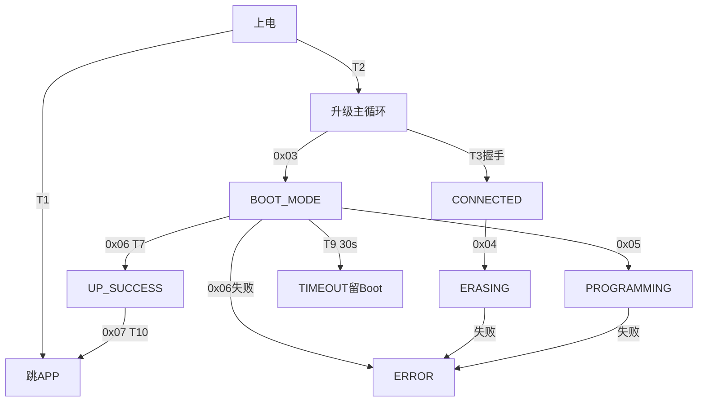

# J57AA OTA 全流程交互说明（当前固件源码提取版）

> 本文描述升级相关的**所有交互场景**：每一步发什么帧、期望什么响应、成功/失败各去哪。全部依据当前固件源码（快照 `J57AACode_20260507/J57AACode_20260507`），带 `文件:行号` 证据；帧格式与字段细节见 [OTA 协议说明](OTA_PROTOCOL_SPEC.md)。未连接真机验证；设备内镜像与源码一致性未证明。

**源码文件别名**同协议说明文档。

## 1. 场景总览

| 场景 | 前提 | 结果 |
|---|---|---|
| 双板状态检测 | 主控APP在线 | 双板模式+代理状态 |
| 主控在APP升级 | 主控APP+固件匹配 | APP→Boot→写→校验→复位 |
| 主控在Boot升级 | 主控Boot+固件匹配 | 直接写→校验→复位 |
| 副板状态查询 | 代理通道建立 | N32 模式判定 |
| 副板升级 | — | **当前网页不实现** |
| 失败恢复 | 擦除后失败 | Boot 完整恢复 |

## 2. 双板状态检测流程

### 2.1 检测序列（网页 device-probe.js 对应的固侧行为）

```text
① F7 信息查询（可选先行）
   发送 AA EE F7 00 00 00 00 F7 BB FF
   期望 AA FE F7 30 [info48] XOR BB FF（55B，Boot响应；APP不回此帧）
② W515 握手
   发送 AA 01 00 04 12 34 56 78 34 81 55
   期望 APP：AA 81 00 04 AA 55 AA 55 9F F4 55
   期望 Boot：AA 81 00 04 87 65 43 21 4B B2 55
③ 若APP：GLPX 代理状态查询（见协议文档§3）
④ 若APP且代理空闲：GLPX 启动 → N32 0x31 握手 → GLPX 停止/释放
⑤ 若Boot：副板标记"不可达"（当前Boot编译无N32代理，WB工程无PX）
```

### 2.2 检测判定矩阵

| 主控模式 | 副板探测 | 依据 |
|---|---|---|
| **APP** | 经代理查 N32 | PX 编译在 APP 工程 |
| **Boot** | **不可达**（无代理） | Boot 工程无 upgrade_proxy.c |
| 未确认 | 无法判定 | 无响应≠空板 |

证据：主控 APP 工程 `Project.uvprojx:340,389,474,489-519` 含 PX；Boot 工程只编译 WM/WB/WP/boot_comm（`:382-486`），WB 分派 `:955-1319` 无 GLPX/N32 代理。

### 2.3 F7 与 GET_INFO 的交叉验证

F7（Boot 响应）与 0x02 GET_INFO 返回**同一 info48 结构同一数据源**（WB:987-991,436-492）。网页用两者交叉验证身份/布局一致性；矛盾时标记主控模式未知。

## 3. 主控在 APP 模式的完整升级流程

### 3.1 交互序列

```text
前置：双板检测通过 + 固件元数据核对（型号/硬件/地址窗口/CRC）

① 请求进Boot  AA 03 00 00 C0 81 55
   期望 AA 83 00 01 00 30 28 55（APP回ACK后直跳Boot）
   ⚠️ APP回ACK后设备重启进Boot，BLE可能断连重连
② 等待Boot模式 AA 01 00 04 12 34 56 78 34 81 55（最多6次，每500ms）
   期望 AA 81 00 04 87 65 43 21 4B B2 55
③ 核对Boot信息 AA 02 00 00 00 D0 55
   期望 AA 82 00 30 [info48]，比对 device_id/app_start/app_max 与检测时一致
④ 擦除 AA 04 00 09 [addr:4BE] [size:4BE] 00 CRC 55
   期望 AA 84 00 01 00 44 29 55（最长等120s）
⑤ 逐包写入（带ACK形态，40B/包）
   AA 05 00 29 01 [addr:4BE] [data:40] CRC 55
   期望 AA 85 00 01 00 B8 28 55（每包等待，丢ACK即停）
   每16包或末包插入 0x09 状态查询核对 written_size
⑥ 校验 AA 06 00 10 [addr:4BE] [size:4BE] [crc:4BE] [ver:4BE] CRC 55
   期望 AA 86 00 01 00 FC 28 55（最长30s）
   再查 0x09 确认 state=0x20 且 verify诊断一致
⑦ 写后信息 AA 02 00 00 00 D0 55 → 核对 app_size/app_crc
⑧ 复位 AA 07 00 00 01 C0 55
   期望 AA 87 00 01 00 00 29 55（仅升级成功态放行，WB:1294-1311）
⑨ 等待APP模式 AA 01 ... → 期望 AA 81 00 04 AA 55 AA 55 9F F4 55
⑩ APP信息核对 AA 02 → device_id/app_size/app_crc/sw_ver 匹配 → 完成
```

### 3.2 关键规则（源码证据）

| 规则 | 内容 | 证据 |
|---|---|---|
| 顺序ACK | 每包等待ACK，不并发 | w515-ota.js:84-95（网页侧）；WB:1132-1134 |
| 计数核对 | 每16包查0x09，written_size不符即停 | WB:1263-1267 |
| VERIFY后禁握手 | **源码不存在此限制**；但VERIFY成功置STATE_UPGRADE_SUCCESS，0x07要求此态 | WB:1210-1224,1294-1296 |
| 擦除后失败 | 保持供电，重新检测，Boot完整恢复 | RTC_BKP10=APP_PENDING 逻辑 |
| 写入地址约束 | ≥0x08008000、4对齐、end≤0x08200000 | WB:680-688,728-811 |

### 3.3 状态机视图（Boot 侧）

**条件字典**：

| 标签 | 判定式 | 位置 |
|---|---|---|
| T1 | `app_valid && !need_upgrade` | WP-main:611 |
| T2 | `RTC_BKP10==BOOT_MAGIC \|\| ==BOOT_DIRECT \|\| ==APP_PENDING` | WB:576-578 |
| T3 | `magic == HANDSHAKE_MAGIC_REQ` | WB:968 |
| T7 | `calculated_crc==verify_crc && meta三连一致` | WB:1210-1218 |
| T9 | `(get_tick()-last_activity)>30000` | WB:885-888 |
| T10 | `s_state==STATE_UPGRADE_SUCCESS && check_app_valid()` | WB:1295-1296 |

**转移矩阵**：

| 事件 | 前置 | 去向 | RTC_BKP10 |
|---|---|---|---|
| 上电(T1) | — | 跳APP | NORMAL_RUN |
| 上电(T2) | — | IDLE | APP_PENDING |
| 握手(T3) | 任意 | CONNECTED | 不写 |
| 0x03 | 任意 | BOOTLOADER_MODE | APP_PENDING |
| 0x04成功/失败 | — | 回IDLE/ERROR | APP_PENDING |
| 0x05成功/失败 | — | 停留/ERROR | APP_PENDING |
| 0x06(T7) | — | UPGRADE_SUCCESS | **APP_MAGIC** |
| 0x06失败 | — | ERROR | APP_PENDING |
| T9超时 | 0x10~0x13 | TIMEOUT（留Boot） | APP_PENDING |
| 0x07(T10) | 0x20 | 复位→跳APP | APP_MAGIC |



**RTC_BKP10 魔数表**（WP-cfg:98-104）：

| 值 | 常量 | 语义 |
|---|---|---|
| 0x00B1234B | BOOT_MAGIC | 旧APP软复位升级入口 |
| 0x00D1234D | BOOT_DIRECT_MAGIC | APP保电直跳交接 |
| 0x00A1234A | APP_PENDING_MAGIC | 升级中/恢复态 |
| 0x00B5678B | APP_MAGIC | 升级成功标记 |
| 0x00C1234C | NORMAL_RUN | 普通冷启动 |

## 4. 主控在 Boot 模式的直接升级流程

前提：双板检测显示主控 BOOT（如升级中断后重启、或 0x38 触发残留）。

```text
① 跳过 0x03（已在Boot）
② 核对Boot信息（0x02）→ ③擦除 → ④逐包写 → ⑤校验 → ⑥复位 → ⑦等APP
（序列同§3.1的②~⑩；副板此时不可达，检测流程标记UNREACHABLE）
```

关键差异：无 0x03、无 APP→Boot 切换断连；**副板状态不可查**（Boot无代理），升级完成后重新检测副板。

## 5. 副板（N32）相关流程

### 5.1 N32 Boot 窗口行为

上电后 **5 秒窗口**（BOOT_WINDOW_MS=5000, NB:54,1478）：

| 条件 | stay_boot | 去向 |
|---|---|---|
| RTC BKP10R=="N32B" | **1永久** | 留Boot |
| APP向量无效 | **1永久** | 留Boot |
| 收到任何完整命令帧 | **置1保持** | 处理命令 |
| 帧错（超时/超长/CRC错） | **置1保持** | 回0xFF+错误 |
| 窗口到期且不停留 | 0 | jump_to_app |

⚠️ **收到一次查询即永久停留**——检测会话查询副板 Boot 会使其不再自动跳 APP（NB:1498-1502）。

### 5.2 副板 APP→Boot 切换（0x38）

```text
发送 AA 38 00 04 4E 33 32 41 74 61 55（经代理转发）
期望 AA B8 00 05 00 4E 33 32 41 FB 78 55（APP回显后复位进Boot）
之后 0x31 握手响应 magic 从 "N32A" 变为 "N32B"
```

⚠️ 副板复位后 **5秒窗口**内未再收到命令则跳回 APP；网页当前不实现副板升级，仅检测。

### 5.3 副板升级流程（Boot 模式，当前网页不实现）

```text
① 0x31握手确认Boot  ② 0x33擦除(页2048对齐)  ③ 0x34顺序写入(带ACK位)
④ 0x35校验(响应带16B诊断)  ⑤ 0x37进APP 或 0x36复位
```

顺序锁：0x34 的 addr 必须 == APP_BASE+written_size（NB:1257-1258）；重复写（内容匹配）仅计数不报错（NB:1259-1270）；跳写→0x03。

## 6. 16 种镜像组合的流程选择

B+/B−=主控Boot完好/损坏；A+/A−=主控APP完好/损坏；副板同理。列=主控状态，行=副板状态：

| 副板\主控 | B+ A+ | B+ A− | B− A+ | B− A− |
|---|---|---|---|---|
| **B+ A+** | 可查双板 | 先恢复主APP | 先修主Boot* | 同左 |
| **B+ A−** | 副Boot待恢复 | 先主后副 | 先修主Boot* | 同上 |
| **B− A+** | 先修副Boot* | 先主再修副B* | 两板Boot检修* | 同上 |
| **B− A−** | 先修副Boot* | 同上 | 同上 | 同上 |

\* = 需已授权的硬件烧录，**不是网页按钮**。主控 Boot 运行时先恢复主 APP（当前Boot无N32代理）；"恢复副APP"是后续经验证的副板工具/产线工序。

依据：Boot 工程 无 PX（`:382-486`）；`APP_ENABLE_N32_BOOT_DIRECT_TEST=0`（WA-cfg:100-122，调试直通非默认能力）。

## 7. 失败分支汇总

| 失败 | 固件侧行为 | 恢复动作 |
|---|---|---|
| 握手无响应 | APP/Boot 均静默（CRC错）或magic错不回 | 重发/重连，模式未知 |
| 0x04擦除失败 | 回0x03，STATE_ERROR，BKP10=APP_PENDING | 重新检测后完整恢复 |
| 0x05丢ACK | 网页停发；Boot侧已写入计数继续 | 查0x09核对written_size后续写或重刷 |
| 0x05写失败 | 回0x03，STATE_ERROR | 同擦除失败 |
| 0x06 CRC不符 | 回0x06，STATE_ERROR，BKP10=APP_PENDING | 不复位；重新擦写 |
| 0x06 meta三连不符 | 同上 | 固件镜像须含有效FIRM meta |
| 0x07未升级成功 | 回0x06拒绝复位 | 先完成校验 |
| 升级态30s无活动 | STATE_TIMEOUT，**留Boot**，协议重置 | 重新握手继续 |
| BLE断连 | Boot无自动续传 | 网页重连+重新检测+续写或重刷 |
| 已擦除后断电 | BKP10=APP_PENDING，重启仍进Boot | 完整恢复APP |

（T9: WB:885-888；错误码使用点 WB:959,997,1010,1045-1046,1070,1124,1151,1228,1232,1300,1314）

## 8. 检测会话的代理通道流程

（GLPX 启动/状态/停止/超时的逐步交互——由代理提取任务补充，占位）

## 9. 时间参数汇总（源码常量）

| 参数 | 值 | 证据 |
|---|---|---|
| Boot升级态超时 | 30000ms | WB:885-888 |
| N32 Boot窗口 | 5000ms | NB:54 |
| AA帧收集超时(N32 APP) | 100ms | NA:12 |
| 遗留/弹道收集超时(N32) | 150ms | NI:54 |
| GLPX空闲超时 | 5000ms | PX（待补行号） |
| GLPX总会话超时 | 12000ms | PX（待补行号） |

## 10. 不确定项/缺口

- 设备内镜像与源码快照一致性未验证（无真机）。
- 27字节 GLPX 一次 GATT 写入的 UART 呈现：待真机验证。
- ATT MTU 协商：浏览器不可查询，吞吐未验证。
- N32 副板升级：Boot 侧协议已完整提取（§5.3），但网页/上位机均未实现调用链。
