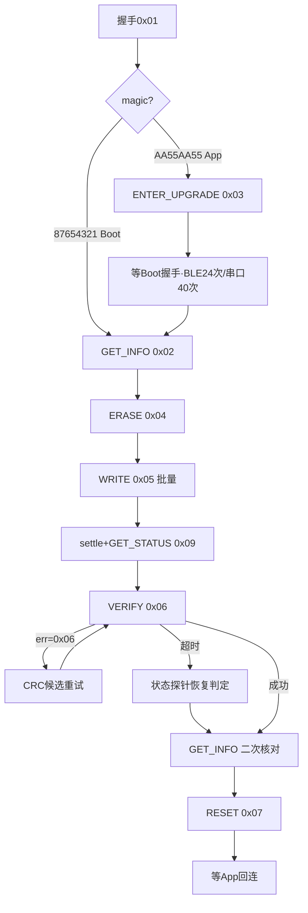

# J57AA BLE OTA 移植考古资料（PC→浏览器，历史参考）

> **已被当前固件核对结果取代，不可直接作为操作指南。** 本文保留旧 PC 实现的提取记录，不保证与当前固件一致。当前字段与编译入口见 [CURRENT_FIRMWARE_OTA.md](CURRENT_FIRMWARE_OTA.md)，实际操作见 [UPGRADE_GUIDE.md](UPGRADE_GUIDE.md)。其中旧地址、无条件重试、CRC候选回退、Boot代理等描述均不得套用于当前网页。

> 依据：`E:\phase1\debug_toll\unified-tool\web_api\debug_api.py`（8087 行，下称 debug_api.py，行号写作 Lxxxx）、`web\pages\debug_pro.html`（下称 html，行号写作 Hxxxx）、`core\ble_gatt.py`（下称 ble_gatt.py）。仅只读分析，未修改 unified-tool 任何文件。
> 行号标注：`L6799` = debug_api.py 第 6799 行；`H4926` = debug_pro.html 第 4926 行；`B855` = ble_gatt.py 第 855 行。

---

## 0. 基础帧格式（全链路共用）

### 0.1 W515 主控 / N32 Boot 升级帧（`_build_upgrade_packet` L3330-3334）

```
AA  CMD  LEN_H  LEN_L  PAYLOAD...  CRC_H  CRC_L  55
1   1    1      1      N           1      1      1
```

| 字段 | 偏移 | 说明 | 证据 |
|---|---|---|---|
| SOF | 0 | 固定 `0xAA` | L3334 |
| CMD | 1 | 命令字，响应 = 请求\|0x80 | L3054 |
| LEN | 2..3 | payload 长度，**大端** u16 | L3332 |
| PAYLOAD | 4..4+N-1 | 数据 | L3332 |
| CRC | 倒3..倒2 | CRC16（Modbus）覆盖 `CMD+LEN+PAYLOAD`（**不含 AA、不含 55**），**大端**（高字节在前） | L3332-3334 |
| EOF | 倒1 | 固定 `0x55` | L3334 |

前端 JS 等价实现（可直接移植）：`buildUpgradePacket` H7568-7584。

### 0.2 代理帧（`_build_proxy_packet` L3406-3423，详见 §5）

```
AA  7E  LEN_H  LEN_L  "GLPX"  MODE  SESSION(4B,BE)  BAUD(4B,BE)  IDLE(4B,BE)  TOTAL(4B,BE)  [FLAGS(1B)]  CRC_H  CRC_L
```
- 无 `0x55` 结束符（L3423）。
- CRC16 覆盖 `AA + 7E + LEN + PAYLOAD`（**含 AA**，这是与 0.1 的关键差异，L3422）。

---

## 1. W515 主控 OTA 状态机

### 1.1 命令字总表

| 命令 | 值 | 方向 | payload | 证据 |
|---|---|---|---|---|
| 握手 HANDSHAKE | 0x01 | PC→Boot/App | `12 34 56 78`（大端 magic） | H4939, H5925 |
| 获取信息 GET_INFO | 0x02 | PC→Boot | 空 | H4940, H5958 |
| 进升级 ENTER_UPGRADE | 0x03 | PC→App | 空（发送后不等待，设备复位进 Boot） | H4941, H6892-6897 |
| 擦除 ERASE | 0x04 | PC→Boot | 9B（见 1.4） | H4942, H7001 |
| 写入 WRITE | 0x05 | PC→Boot | addr(4B BE)+data 或 `01`+addr+data | L6905-6909 |
| 校验 VERIFY | 0x06 | PC→Boot | 16B（见 1.6） | H7231-7241 |
| 复位 RESET | 0x07 | PC→Boot | 空 | H4945, H7376 |
| 查状态 GET_STATUS | 0x09 | PC→Boot | 空 | L6590 |

响应帧：`AA (cmd|0x80) LEN payload CRC 55`（同 0.1 帧格式，L3054）。

### 1.2 状态机



### 1.3 握手（0x01）

| 维度 | BLE | USB 串口 | 证据 |
|---|---|---|---|
| 超时 | **1800ms** | 2500ms | H5926 |
| 失败重试 | **再试1次（sleep 120ms）** | 无 | H5928-5932 |
| 请求 payload | 同上 | 同上 | 同上 |
| 期望响应 | payload 前 4B 大端 magic | 同上 | H5944-5946 |

- Boot 响应 magic = `0x87654321`；App 响应 magic = `0xAA55AA55`（H4948-4950）。
- 底层 `_upgrade_send_and_wait_once`（L3131-3260）：发送后轮询 RX（2ms 粒度，L3210），在原始字节流中搜帧（`_find_upgrade_response_frame` L3013-3072）；BLE 通道整体自动重试 1 次（断连时先按 MAC 重连，L3299-3325）。
- 帧搜索细节：SOF=`AA`，LEN>4096 跳过（L3034），帧长 = 4+LEN+3（含 55），cmd 必须 = `expected|0x80`，CRC 在帧[-3..-2]、覆盖 frame[1:-3]（L3050-3063）；若 CRC 不匹配且 expected_cmd ≥ 0x31，另试覆盖 frame[:-3] 的旧 N32 算法（L3064-3065）。

### 1.4 擦除（0x04）

payload（9B，全部**大端**，H7001-7006）：

```
ADDR_H  ADDR_MH  ADDR_ML  ADDR_L   ADDR_H ...
[addr 4B BE] [erase_size 4B BE] [encrypted_flag 1B]
```
- `encrypted_flag`：加密固件=0x01，普通=0x00（H7005）。
- `erase_size` = `ceil(固件大小/4096)*4096`，上限 `appMaxSize`（H6993-6997；Flash 页 4096B）。
- appStart：GET_INFO 返回；旧固件返回 0x08000000 时强制 `0x08004000`（H6836-6840）。
- 超时：BLE **120000ms**，串口 **45000ms**（H7009）。
- 期望响应：ACK，payload[0]==0（H7617-7626：ERASE/WRITE/VERIFY/RESET 用 payload[0] 作错误码；HANDSHAKE/GET_INFO/GET_STATUS 直接看数据）。

### 1.5 进 Boot（App→Boot 切换）

- 方式 = `ENTER_UPGRADE 0x03` 空帧，发送后**不等响应**（500ms 超时忽略，设备立即复位，H6892-6898）。
- BLE：**保持连接**等 Boot——sleep 250ms 后最多 24 轮握手（每轮 1200ms 超时 + 250ms 间隔）；若握手回 App magic 则补发 0x03；每 3 轮静默 `debug_connect_ble` 重连一次（H6902-6944）。
- 串口：USB 重新枚举，40 轮 × 50ms 重连同一 COM（460800）+ 握手 1000ms（H6946-6985）。
- **「标志+复位」与「旧 IAP 0x84」路径：本代码库未见**（0x84 仅作为代理诊断事件名 `n32_frame_crc_ok` 出现，L2816/L2909）——**未确认**，移植时不需要。

### 1.6 校验（0x06 VERIFY）

payload 16B，全部**大端**（H7231-7241）：

```
[app_start 4B BE] [size 4B BE] [crc32 4B BE] [version 4B BE]
```
- 超时 12000ms（H7252）。
- 失败处理：payload[0]==0x06（CRC 不符）→ 按 candidates 列表换 CRC 候选重发（H7291-7312）；超时 → GET_STATUS 探针，若 state==0x20 且 verify diag 通过 → 判成功继续（H7261-7283）；仍失败 → 重擦除 + 保守重写（chunk 112 / GATT 20 / 每包 ACK / delay 6ms，H7324-7340）。
- 成功后：再发 GET_INFO，比对 MCU 上报 appSize/appCrc 与 PC 计划（H7351-7369）。

### 1.7 复位（0x07）与收尾

- RESET 空帧，超时 1000ms（H7376）。之后等待 App 起来：握手看 magic==AA55AA55，12 轮 × 350ms（H7383-7399；BLE 回连循环 H6065-6096）。

### 1.8 GET_STATUS（0x09）响应解析（`_upgrade_parse_status_frame` L6556-6586；`_upgrade_get_status_quick` L6589-6603）

响应 payload（**大端** u32）：

| 偏移 | 字段 | 说明 |
|---|---|---|
| 0 | state | 状态码（0x20=verify 相关，H7266） |
| 1..4 | written_size | Boot 当前已写字节（**大端**） |
| 5..8 | ore_count | RX 溢出计数 |
| 9 | verify result | 校验结果 |
| 13..16 | verify count | |
| 17..20 | verify addr | |
| 21..24 | verify size | |
| 25..28 | expected_crc | |
| 29..32 | calculated_crc | |
| 33..36 | meta_magic | |
| 37..40 | meta_size | |
| 41..44 | meta_crc | |
| 45..48 | elapsed_ms | |

前端等价：`parseUpgradeStatusPayload` H5669-5694。查询帧超时：默认 1200ms（L6589），写窗口内用 1800ms（L7121）。

---

## 2. W515 写入循环细节（`_patched_upgrade_write_batch_fast` L6755-7293）

### 2.1 参数规则

| 参数 | 规则 | 证据 |
|---|---|---|
| chunk_size | 默认 256；上限 `_upgrade_write_chunk_cap`=1024（8B 对齐，L6639-6653）；再 `max(8,(chunk//4)*4)` 4B 对齐 | L6678-6688, L6788 |
| 前端默认 | **224**（OTA_CHUNK_SIZE），UI 可调 8..1024 步进 4 | H4931, H5418-5421 |
| BLE 旧流式路径上限 | 208（`_patched_upgrade_write_batch`） | L6681 |
| ble_gatt_chunk | 请求值 clamp `max(20, min(v, 244))`；写入后还原 | L6796-6802, L7251-7255 |
| _write_response | **BLE 写入期间强制 True**（写请求模式），结束后还原 | L6803-6808, L7256-7260 |
| inter_packet_ms | 默认 2ms，clamp 0..80 | L6773, L6789 |
| status_window_packets | BLE 默认 **6**，clamp 1..16（=1 → 每包 ACK 模式；=0 → 纯流式）；串口默认 0 | L6819-6827, H7310 |
| 前端默认 delay | 3ms（OTA_PACKET_DELAY_MS） | H4933, H5426-5429 |

### 2.2 BLE 包间延时（L6893-6902）

```
wire_ms  = (len(data)+12)*10*1000 / pacing_baudrate + 3
flash_ms = len(data)*18/1024 + 6
窗口模式(window>1):  effective_delay = delay_ms
每包ACK/流式:        effective_delay = max(delay_ms, min(wire_ms+flash_ms, 80))
```
- pacing_baudrate = `_ble_write_pacing_baudrate()`（L6813）：环境变量 `GL_BLE_WRITE_PACING_BAUDRATE`，缺省 `GL_BLE_UART_BAUDRATE`，再缺省 115200，clamp 9600..921600（L750-763）。

### 2.3 WRITE 帧 payload（L6905-6910）

- 流式/窗口模式：`[addr 4B BE] + data`，帧 CMD=0x05，**不等每包 ACK**。
- 每包 ACK 模式（window==1）：payload 前多 1 字节 `0x01`：`01 + addr + data`，发送后等 ACK（超时 5000ms，L6921）。

### 2.4 每包 ACK 模式的重试（L6934-7070）

BLE 模块（E104-BT5005A）在约 13 个透传周期后可能停止转发。失败重试 5 轮：
- 第 1-2 轮：sleep 5s（保连接）→ 握手探活（0x01 / `12 34 56 78`，8000ms）→ 重发同包（8000ms）。
- 第 3-5 轮：sleep 3s → BLE 整链重连（`_upgrade_refresh_ble_connection` L3107-3128，按 MAC 快速重连）→ sleep 2s → 握手 → 重发。
- 5 轮均失败 → 报错终止。

### 2.5 状态窗口校验（每 6 包查 Boot written_size，L7107-7232）

| 维度 | 规则 | 证据 |
|---|---|---|
| 触发 | `packet_index % window == 0` 或最后一包 | L7107-7111 |
| 查询 | `_upgrade_get_status_quick(1800)`，最多 4 次，每次间隔 `min(0.35, 0.06*attempt)`s | L7120-7136 |
| 成功 | `written_size >= 本窗口目标（offset+len(data)）` | L7127 |
| 落后 | 若 `0<=written<total 且 written%chunk==0` → **断点续写**（offset=written）；否则报错 | L7176-7193 |
| 超前 | 对齐到包边界 `offset=(written//chunk)*chunk` 续写 | L7214-7220 |
| 无响应 | 直接判失败返回 | L7137-7174 |

### 2.6 进度模式标签（L6829-6832）

| window | mode | UI 文案 |
|---|---|---|
| 1 | `fast-write-ack` | 每包ACK |
| >1 | `fast-window-status` | 窗口闭环 |
| 0 | `fast-final-crc` | 流式/最终CRC |

进度上报字段：written/total/chunk/packets/packet_index/speed/boot_written/gatt_chunk/status_window_packets（L7093-7103）；前端 200ms 轮询 `upgrade_write_progress`（H7061-7101）。

### 2.7 VERIFY 前 settle

- 后端：写完 sleep **2.35s**（BLE，Boot 半帧超时 FRAME_TIMEOUT_MS=2000，L7235-7239）/ 0.08s（串口）。
- 前端：窗口闭环完成（boot_written==payloadSize）→ 350ms；否则 2300ms（H7195-7200），随后 GET_STATUS（1500ms）打探针。

### 2.8 前端调优预设（H5494-5501）

| 预设 | gatt | chunk | window | delay |
|---|---|---|---|---|
| fast | 240 | 224 | 6 | 3 |
| compat | 240 | 208 | 6 | 3 |
| stable | 120 | 112 | 3 | 5 |
| safe | 20 | 40 | 1 | 6 |

VERIFY 失败自动重试（BLE）：chunk 112 / GATT 20 / window 1 / delay 6（H7328-7334）。

---

## 3. 校验算法

### 3.1 CRC16-Modbus（帧 CRC，L2696-2706；JS 版 H7554-7564）

```text
crc = 0xFFFF                       # 初值
for byte in data:                  # data = CMD + LEN(2B) + PAYLOAD（不含 AA/55）
    crc ^= byte                    # 低 8 位异或
    repeat 8:
        if crc & 1: crc = (crc >> 1) ^ 0xA001   # 反转多项式 0xA001（= CRC16-Modbus）
        else:       crc = crc >> 1
        crc &= 0xFFFF
return crc                         # 无 xorout
```
- 线上字节序：**先高字节后低字节**（L3334 `[(crc>>8)&0xFF, crc&0xFF]`）。
- JS 逐位实现（H7554-7564）与 Python 完全等价，可直接移植。

### 3.2 CRC32（W515 固件校验 + N32 固件校验）

- W515：前端标准 CRC32（查表，poly 反射 0xEDB88320，init/xorout 0xFFFFFFFF，H7797-7842）。**注意兼容计算** `calcFirmwareCrc`（H7810-7829）：元数据区 `0x200+0x20`（app_size 4B）与 `0x200+0x24`（app_crc 4B）置 `0xFF` 后再算整包 CRC32——与固件 post_build.py 一致。
- N32：Python `binascii.crc32`（L5386，标准 zlib CRC32）交叉验证于 `_range_n32_boot_crc32_equiv`（L4464-4474，逐位镜像 MCU_Slave_Boot_N32 的 `crc32_update`，两者结果必须相等，L5407-5409）。JS 等价即标准 CRC32 查表实现。

### 3.3 W515 固件元数据（`readFirmwareMeta` H6259-6320）

64B 位于固件偏移 `0x200`，**小端**：

| 元内偏移 | 字段 |
|---|---|
| 0x00 | magic `0x4649524D`("FIRM")，4B |
| 0x04 | version（Major<<24\|Minor<<16\|Patch<<8\|Build） |
| 0x08 | hw_version |
| 0x0C | build_time（Unix） |
| 0x10 | model_name 16B（0 结尾） |
| 0x20 | app_size（post_build.py 填充） |
| 0x24 | app_crc（post_build.py 填充） |

VERIFY CRC 候选顺序（H5721-5800）：加密头 `enc-header` → `firmware-meta`（元数据 crc）→ `meta-compatible-calc`（§3.2 兼容 CRC）→ `raw-calculated`（整包裸 CRC32）；写入 payload 取 `firmware.slice(0, meta.appSize)`（H5803-5809）。

---

## 4. N32 测距板 Boot 升级

### 4.1 常量（L4434-4453）

| 常量 | 值 | 含义 |
|---|---|---|
| BOOT_MAGIC | `"N32B"` | Boot 魔数（ASCII 4B） |
| APP_MAGIC | `"N32A"` | App 魔数 |
| APP_BASE | 0x08002000 | App 区起始 |
| APP_END | 0x0800F7FF | App 区结束 |
| CONFIG_BASE | 0x0800F800 | 配置页（禁写） |
| PAGE_SIZE | 0x800 | 擦除页 2KB |
| WRITE_CHUNK_CAP | 224 | 写块上限 |
| STREAM_GAP_MS | 0 | 流式包间隔默认 |
| CMD 握手 | 0x31 | |
| CMD_INFO | 0x32 | |
| CMD 擦除 | 0x33 | |
| CMD 写 | 0x34 | |
| CRC 校验 | 0x35 | |
| 复位 | 0x36 | |
| 进 APP | 0x37 | |
| **App 进 Boot** | **0x38** | |
| 状态 | 0x39 | |
| 弹道回显 | 0x3A | |

帧格式同 §0.1（AA cmd len payload crc 55）。状态码：0x00 ok / 0x01 bad_cmd / 0x02 bad_length / 0x03 bad_range / 0x04 bad_crc / 0x05 flash_error / 0x06 verify_error（L4477-4487）。

### 4.2 主流程（`range_n32_boot_flash` L5304-6033，前端调用参数 H6660-6682）

前置：必须先开测距代理（`_range_n32_require_proxy`，allowed=("normal_protocol","raw_upgrade")，L5335-5340；JS 侧 N32 升级实际走 **RAW 透传代理** H6670-6682）。BLE 场景必须 BLE 连接（H6857-6860）。

| 步骤 | 帧与参数 | 超时 | 证据 |
|---|---|---|---|
| ① 进 Boot | `0x38` + payload `"N32A"`；**先发 1 字节诱饵 `0xAA`，等 150ms**（清旧字节供给器），再发完整帧，发后等 300ms | 不等响应 | L4763-4779 |
| ② 握手探测 | `0x31` + `"N32B"`；响应 payload 应以 `N32B` 开头（App 回 `N32A` → 需先进 Boot，L5229-5236） | 1200ms | L5222-5258 |
| ③ 擦除 | `0x33` + `"N32B"` + start(4B BE) + erase_size(4B BE) + page_size `0x0800`(2B BE)；erase_size=ceil(size/0x800)*0x800 | 8000ms | L5434-5442, L5378 |
| ④ 写入 | `0x34` + [01] + addr(4B BE) + data；chunk 224、4B 对齐、尾包补 `0xFF`；流式无 ACK 或每包 ACK（4 次重试，0.18*n 秒退避） | 写 3500ms | L5604-5638, L5619 |
| ⑤ CRC 校验 | `0x35` + `"N32B"` + start(4B BE) + size(4B BE) + crc32(4B BE) | 12000ms | L5833-5853 |
| ⑥ 复位/进 APP | `0x37`（进 App）或 `0x36`，payload `"N32B"` | 1000ms | L5263-5273, L5987 |

- **进 Boot 前置不是 "ub\n"**：本实现是代理 + 0x38 帧（"ub\n" 属旧 jswyll IAP 协议，已禁用，L3944-3947）——原任务描述中的 "ub\n" 与「旧 IAP」路径在当前代码中不存在，**未确认**。
- 地址窗口校验（`_range_n32_validate_window` L4709-4725）：`start >= 0x08002000`、`start+size-1 <= 0x0800F7FF`、不得写入配置页 0x0800F800。
- 流式 gap（`_range_n32_stream_gap_ms` L4701-4706）：请求值 clamp 0..120ms，默认 0；实际间隔 = max(0, gap - 单包循环耗时)（L5678-5681）。
- WRITE 尾包 4B 对齐补 0xFF，但 CRC 按原始字节算（L5608-5609，docstring L5324-5326）。
- VERIFY 失败回退链（L5855-5953）：先查状态（0x39），若 `boot_written%4==0` 断点 ACK 补写 → 再 VERIFY；仍失败 → 整片重擦 + ACK 保守重写 → VERIFY；RAW 链路失步时等 RAW idle（默认 2000ms）自动恢复 NORMAL 后重开 RAW 代理再重试（`_recover_raw_proxy_for_fallback` L5493-5527）。
- 状态响应（0x39）payload 诊断结构（`_range_n32_parse_status_diag` L4502-4538，均**大端**）：boot_written(0:4) / last_write_addr(4:8) / last_write_len(8:12) / rx_irq(12:16) / rx_overflow(16:20) / rx_error(20:24) / last_verify_addr(24:28) / last_verify_size(28:32) / expected_crc(32:36) / actual_crc(36:40) / write_gap_count(40:44) / duplicate_write_count(44:48) / last_cmd(48) / last_status(49) / last_write_status(50) / last_verify_status(51) / [62B 版本：rx_byte_count(52:56) / rx_frame_len(56:58) / rx_payload_len(58:60) / rx_result(60, 有符号) / last_rx_byte(61)]。
- 旧版短 ACK 帧：`AA (cmd|0x80) 00 00 CRC 55`（空 payload 也算成功，握手/信息则视为旧版报错，L4550-4567）。
- ACK 帧批量收集（`_range_n32_collect_ack_frames` L4635-4678）：窗口 ACK 模式（已禁用，L5813 `window_ack_enabled = False`）按窗口收 N 个 ACK 帧；保留给主控链路。

---

## 5. 代理控制（W515 主控 UART 代理）

### 5.1 帧格式（`_build_proxy_packet` L3406-3423）

请求（PC→W515）：

```
AA  7E  LEN_H  LEN_L  47 4C 50 58  MODE  SE0 SE1 SE2 SE3  BD0..BD3  ID0..ID3  TO0..TO3  [FLAGS]  CRC_H  CRC_L
                          "G L P X"        session 4B BE   baud 4B  idle 4B    total 4B   仅 start 且 flags≠0
```

| 字段 | 说明 | 证据 |
|---|---|---|
| CMD | 固定 `0x7E`（_PROXY_REQ_CMD L3355）；响应 cmd 也是 0x7E（**非 0xFE**，L3427 注释） | L3420 |
| MAGIC | `"GLPX"` | L3412, L3337 |
| MODE | start=0x01 / stop=0x02 / status=0x03 / keepalive=0x04 | L3340-3343 |
| SESSION | 4B 大端，随机 31bit | L3736, L3414 |
| BAUD / IDLE / TOTAL | 各 4B 大端；缺省 115200 / 60000 / 300000 | L3415-3417 |
| FLAGS | 仅 START 帧且非 0 时追加 1B：RAW_UPGRADE 0x02 / BALLISTIC 0x04 / RAW_DIAG 0x08（互斥） | L3418-3419, L3737-3747 |
| CRC | CRC16 覆盖 `AA+7E+LEN+payload`（**含 AA**，无 0x55 尾） | L3421-3423 |

**注意：`target` 参数（range=0x02 / main=0x01，L3353-3354）并未写入帧内**——`_build_proxy_packet` 收参但帧体不含 target 字段（L3406-3423 通读无 target 字节）→ 固件如何区分目标**未确认**（可能帧格式与固件 upgrade_proxy.c 另有约定，或 target 仅 PC 侧记录）。

响应（W515→PC）：`AA 7E LEN "GLPX" status CRC`（无 0x55，L3426-3453）；`status==0` 即成功。状态码表（L3361-3376）：0x00 ok / 0x01 bad_frame / 0x02 bad_target / 0x03 busy / 0x04 session_mismatch / 0x05 inactive / 0x06 bad_baud / 0x07 unsupported / 0x10-0x15 ballistic 系列。

### 5.2 三个控制接口

| 维度 | upgrade_proxy_start L3718-3765 | upgrade_proxy_stop L3856-3883 | upgrade_proxy_status L3886-3909 |
|---|---|---|---|
| MODE | 0x01 | 0x02 | 0x03 |
| flags | RAW/BALLISTIC/DIAG（互斥，>1 报错） | 0 | 0 |
| 默认参数 | target=range, baud=115200, idle=60000, total=300000 | 同上 | 同上 |
| 超时 | 3000ms | 3000ms | 3000ms |
| 成功副作用 | 记录 session/target/mode/idle/total/started | 清本地会话（status=0x05 inactive 也算成功） | 确认 normal 活跃或 0x05 清会话 |
| 失败副作用 | 标记 recovery_pending | 超时→标记 `proxy_stop_timeout` 恢复态 | — |

- 控制节流：`_PROXY_RECOVERY_GUARD_MS = 300`（L3352，`_proxy_control_guard`）。
- keepalive（L3912-3932）MODE=0x04。
- raw_upgrade 便捷入口 `upgrade_proxy_enter_raw`（L3768-3773，idle 2000）；诊断 raw（L3776-3793，idle 1500 / total 10000）；弹道单事务（L3796-3811，idle=reply_timeout 2000 / total 5000）。
- 升级会话代理态下，主控 0x01-0x07 Boot/App 命令会被拒绝（L3285-3295，需先 proxy_stop）。

---

## 6. BLE 传输层要点（BleSerial，core/ble_gatt.py）

| 维度 | 规则 | 证据 |
|---|---|---|
| BLE 模块 | E104-BT5005A（UART 桥，桥接波特率 115200） | B56-57, L6935 注释 |
| 服务/特征 | FFF0 服务：notify FFF1/FFF3，write FFF2/FFF3；备用 Nordic UART（6e400001…） | B41-54 |
| GATT 写分片 | `_gatt_write_chunk` 缺省 **244**（GL_BLE_RELIABLE_WRITE=1 时 20；env `GL_BLE_GATT_CHUNK` clamp 20..244）；API 覆盖时 clamp `max(20,min(v,244))` | B853-855, L6799 |
| 分片间隔 | `min(50ms, chunk*10/baud*0.18 + 0.3ms)`（默认 drain_ratio 0.18、guard 0.3ms；可 env 覆盖） | B856-878 |
| 大分片失败回退 | chunk>20 写失败 → 自动回退 20B 重发并锁定 `_gatt_write_chunk=20` | B905-917 |
| write_response | 缺省 `GL_BLE_WRITE_RESPONSE=0`（选 write-without-response 特征）；**OTA 写入循环强制 `ser._write_response = True`**（Write Request，防丢包） | B665-684, L6803-6808 |
| 写节流 | pacing baudrate 见 §2.2（L758-763） | B750-763 |
| RX | notify 队列缓存，升级收包直接读 RX 队列（运行时读线程需挂起：`upgrade_start`/`upgrade_end` H5912/H6853） | L3271-3274 注释 |
| 断线恢复 | `_upgrade_refresh_ble_connection` L3107-3128：disconnect→按 MAC quick 重连→重新挂起读线程 |
| BLE 通道判定 | transport=="ble" 或 port 前缀 `ble://` 或 serial 类名 BleSerial | L3075-3083 |

**浏览器移植注意**：
- Web Bluetooth 的 `writeValue()` 等价 Write Request（带响应）；`writeValueWithoutResponse()` 为 command 模式。对应本实现的 `_write_response=True/False`。
- 244B 分片依赖 MTU≥247；Web Bluetooth 无法显式请求 MTU（Chrome 在特征发现后自动协商）——若实际 MTU 不足会写入失败/丢包，需实现 20B 回退（对应 B905-917）。**未确认** 各浏览器实际 MTU 行为，建议默认 gatt_chunk 用 20 起步或探测。
- 升级期间必须独占 notify 流（对应挂起读线程），否则短回包被其它消费者吃掉（H5910-5912 实测注释）。

---

## 7. 常量表（全部带 debug_api.py / html 行号）

### 7.1 W515 主控 OTA

| 常量 | 值 | 行号 |
|---|---|---|
| 帧 SOF / EOF | 0xAA / 0x55 | L3334 |
| 握手 magic（发送） | 0x12345678（大端 `12 34 56 78`） | H4948, H5925 |
| Boot 响应 magic | 0x87654321 | H4949, H5945 |
| App 响应 magic | 0xAA55AA55 | H4950, H5946 |
| CMD 握手/信息/进升级/擦/写/验/复位/状态 | 01/02/03/04/05/06/07/09 | H4939-4946 |
| Boot 单包数据区上限 | 1024（1032B 扣 4B 地址，8B 对齐） | L6639-6653, H4926 |
| Flash 页（擦除对齐） | 4096 | H6993 |
| appStart（缺省/旧固件纠正） | 0x08004000 | H6837-6840 |
| appMaxSize 缺省 | 108KB | H6842 |
| 握手超时 BLE/串口 | 1800 / 2500 ms | H5926 |
| GET_INFO 超时 BLE/串口 | 2500 / 5000 ms | H5958 |
| 擦除超时 BLE/串口 | 120000 / 45000 ms | H7009 |
| VERIFY 超时 | 12000 ms | H7252 |
| VERIFY 失败重试参数 | chunk 112 / gatt 20 / window 1 / delay 6ms | H7328-7334 |
| RESET 超时 | 1000 ms | H7376 |
| 写 ACK 超时（每包 ACK 模式） | 5000（重试 8000）ms | L6921, L7020 |
| 握手探活超时（重试内） | 8000 ms | L6959, L7000 |
| ACK 失败重试轮数 | 5（1-2 等待、3-5 重连） | L6940 |
| 状态查询超时 | 1200（窗口 1800，4 次）ms | L6589, L7120 |
| 写前 settle（BLE） | 2.35s（后端）/ 350ms·2300ms（前端） | L7238, H7198 |
| CRC16 | Modbus（init 0xFFFF，poly 0xA001 反射，大端线上） | L2696-2706 |
| 固件元数据 | 偏移 0x200，64B，magic "FIRM" 0x4649524D，小端；app_size@0x20 app_crc@0x24 | H6260-6301 |
| 前端调优默认 | gatt 240 / chunk 224 / window 6 / delay 3ms | H4926-4933 |

### 7.2 N32 测距板 Boot

| 常量 | 值 | 行号 |
|---|---|---|
| 命令 31/32/33/34/35/36/37/38/39/3A | 握手/信息/擦/写/验/复位/进App/App进Boot/状态/弹道 | L4444-4453 |
| APP 区 | 0x08002000 ~ 0x0800F7FF（配置页 0x0800F800 禁写） | L4437-4439, L4709-4725 |
| 页大小 | 0x800（2KB） | L4440 |
| 写块上限 | 224（4B 对齐，尾补 0xFF） | L4441, L5345-5346, L5608-5609 |
| 流 gap | 0ms，clamp 0..120 | L4443, L4701-4706 |
| 擦除超时 / 写超时 / 验超时 / 探测超时 | 8000 / 3500 / 12000 / 1200 ms | L5310-5312, L5309 |
| ACK 重试 | 4 次，退避 0.18*n 秒 | L5618-5638 |
| RAW 恢复 idle / total | 2000 / 300000 ms（clamp 2000..30000 / idle+1000..900000） | L5318-5321, L5352-5362 |
| 进 Boot | 诱饵 0xAA + 150ms + 0x38/"N32A" + 300ms | L4763-4779 |
| 状态码 | 0x00~0x06（ok/bad_cmd/bad_length/bad_range/bad_crc/flash_error/verify_error） | L4477-4487 |
| CRC32 | 标准（binascii.crc32 ≡ N32 逐位 0xEDB88320） | L5386, L4464-4474 |

### 7.3 代理控制

| 常量 | 值 | 行号 |
|---|---|---|
| _PROXY_MAGIC / EVENT_MAGIC | "GLPX" / "GLPE" | L3337-3338 |
| _PROXY_VERSION | 0x01 | L3339 |
| CMD start/stop/status/keepalive | 0x01/0x02/0x03/0x04 | L3340-3343 |
| 请求/响应 cmd | 0x7E / 0x7E（非 0xFE） | L3355-3356, L3427 |
| FLAG RAW_UPGRADE / BALLISTIC / DIAG | 0x02 / 0x04 / 0x08 | L3344-3346 |
| TARGET main / range | 0x01 / 0x02（**未入帧**，未确认） | L3353-3354 |
| 控制守卫 | 300ms | L3352 |
| 缺省 baud / idle / total | 115200 / 60000 / 300000 | L3407-3408, L3857-3858 |
| 控制超时 | 3000ms | L3721, L3858, L3888 |
| 错误码 | 0x00-0x07、0x10-0x15（见 §5.1） | L3361-3376 |

### 7.4 BLE 传输

| 常量 | 值 | 行号 |
|---|---|---|
| gatt_write_chunk 默认 / 上限 | 244（reliable 20）/ clamp 20..244 | B854-855, L6799 |
| 分片 guard / drain_ratio | 0.3ms / 0.18 | B869-870 |
| 桥接 UART 波特率 | 115200（env GL_BLE_BRIDGE_UART_BAUD） | B57, B860-865 |
| pacing baudrate | env GL_BLE_WRITE_PACING_BAUDRATE → 115200，clamp 9600..921600 | L758-763 |
| write_response 默认 | False（GL_BLE_WRITE_RESPONSE=0），OTA 内强制 True | B665, L6806 |
| 帧内 data_len 上限（解析） | 4096 | L3034 |
| 升级串口波特率（USB） | 460800 | H6956, L6810 |

---

## 8. 未确认事项汇总

1. **「旧 IAP 0x84」进 Boot 路径**：当前代码只有 0x03 ENTER_UPGRADE；0x84 仅是 GLPE 诊断事件名（L2816）。**未确认**是否存在其它分支。
2. **代理帧 target 字段**：`_build_proxy_packet` 的 target 参数未写入帧体（L3406-3423）；固件端如何区分 main/range 代理**未确认**（响应仅回 status）。
3. **Web Bluetooth 实际 MTU**：244B 分片依赖 MTU≥247，浏览器端实际值**未确认**，建议实现 20B 回退。
4. N32 Boot 握手响应中 `reported_flags`（payload[15]）含义**未确认**（L5257）。
5. W515 加密固件（.enc）的 encHeader 结构（originalCrc/fwVersion）在 html 中引用（H5722-5740），具体二进制格式**未确认**（未在所读范围内找到定义）。
