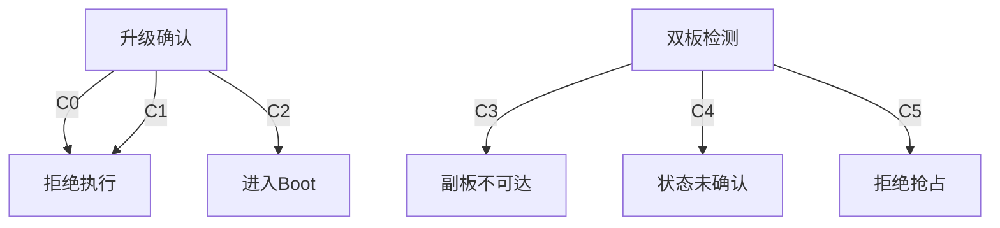

# J57AA 升级操作指南：先查双板，再决定升级

> 适用源码快照：`J57AACode_20260507/J57AACode_20260507` 内当前文件；目录日期不是源码版本。尚无证据证明设备内镜像与这些文件一致。
> 当前网页仅实现 W515 APP 刷写和双板状态检测；未连接硬件验证。不得据离线测试结果认定可量产。
> 字段、编译入口和精确源码证据见 [当前固件协议](CURRENT_FIRMWARE_OTA.md)。[PC 移植考古资料](OTA_PORT_SPEC.md) 不是当前操作依据。

## 操作

1. Android 或电脑 Chrome/Edge 打开 [Scope Connect](https://fasfqwr12.github.io/j57aa-scope-connect/)；选择“浏览器 BLE”，连接自己的设备。
2. 停止测距并保持稳定供电、亮屏、前台；关闭其它占用此设备的上位机或标签页。
3. 打开“升级”，先点“检测双板状态”，阅读并确认查询副作用提示。
4. 分别查看主控模式、副板自身应答、代理状态；无响应不能判断为空板或 APP 丢失。
5. 选择在线候选固件或本地 W515 APP；在线点选仅下载、校验、选择，不会直接刷写。
6. 检查文件型号、硬件版本、元数据 CRC、向量和地址窗口；未检测、过期、断连、窗口错误或代理未释放时禁止升级。
7. 副板无法确认时，只有明确勾选“仅恢复 W515 主控 APP”才能继续；这不会让副板变成“已确认”。
8. 点“确认并升级主控”并再次确认风险；执行前重新检测双板，之后每包等待 ACK。
9. 仅当校验诊断、写后信息和复位后 APP 回应全部匹配才显示完成；完成后重新检测副板。

## 页面状态如何理解

| 维度 | W515 主控 | N32 副板 | 代理通道 |
|---|---|---|---|
| 状态来源 | **01握手** | **31握手** | **GLPX** |
| APP 证据 | **AA55AA55** | **N32A** | **不证明APP** |
| Boot 证据 | **87654321** | **N32B** | **不证明Boot** |
| 无响应含义 | **主控未确认** | **副板未确认** | **通道未确认** |
| 信息限制 | **上报值非校验** | **Boot仅验向量** | **不证明在线** |
| 当前刷写 | **仅APP** | **未开放** | **不适用** |

共性：响应说明当时状态，不是永久保证。
关键差异：通路不可达不等于副板没程序。

## 运行状态转移

### 条件字典

位置别名：P=`src/upgrade/device-probe.js`；O=`src/upgrade/w515-ota.js`。

| 标签 | 判什么 | 判定式 | 代码位置 |
|---|---|---|---|
| C0 | 未明确确认 | `!confirmed` | O:50 |
| C1 | 前置门禁失败 | `gate` | O:61 |
| C2 | 主控在APP | `snapshot.main.mode === "APP"` | O:66 |
| C3 | 主控在Boot | `result.main.mode === "BOOT"` | P:56 |
| C4 | 主控非APP | `result.main.mode !== "APP"` | P:62 |
| C5 | 通道未空闲 | `before !== PROXY_STATUS.INACTIVE` | P:66 |

> 判定式保留源码完整标识符，不用缩写伪造表达式。

### 转移矩阵

| 判定场景 | 双板检测 | 升级前置 | 主控切换 |
|---|---|---|---|
| C0成立 | — | **→拒绝** | — |
| C3成立 | **→副板不可达** | — | — |
| C3否且C4成立 | **→状态未确认** | — | — |
| C4否且C5成立 | **→拒绝抢占** | — | — |
| C4否且C5否 | **→副板握手** | — | — |
| C1成立 | — | **→停止** | — |
| C1否且C2成立 | — | **→固件核对** | **→进入Boot** |
| C1否且C2否 | — | **→固件核对** | **→核对Boot** |



### 代码证据

C0 O:50
```cpp
if (!confirmed) throw new Error("需要明确确认后才允许升级");
```
C1 O:60-61
```cpp
const gate = w515Gate(snapshot);
if (gate) throw new Error(gate);
```
C2 O:66
```cpp
if (snapshot.main.mode === "APP") {
```
C3 P:56
```cpp
if (result.main.mode === "BOOT") {
```
C4 P:62
```cpp
if (result.main.mode !== "APP") {
```
C5 P:65-66
```cpp
const before = await this.proxy(PROXY_MODE.STATUS, 0);
if (before !== PROXY_STATUS.INACTIVE) {
```

## 已安装镜像组合：16种路径覆盖

B+：Boot 可执行；B−：Boot 缺失或损坏。A+：通过该板 Boot 的 APP 检查；A−：APP 缺失或检查失败。仅有文件或版本号不能证明 B+/A+。

以下以正常冷启动、无调试器直接跳转为前提；N32 的 A+ 仅指向量检查通过，不能证明完整程序正确。列为主控镜像状态，行为针对整个设备恢复路径。

| 副板镜像场景 | 主B+ A+ | 主B+ A− | 主B− A+ | 主B− A− |
|---|---|---|---|---|
| 副B+ A+ | **可查双板** | **先恢复主APP** | **先修主Boot** | 同上 |
| 副B+ A− | **副Boot待恢复** | **先主后副** | **先修主Boot** | 同上 |
| 副B− A+ | **先修副Boot** | **先主再修副B** | **两板Boot检修** | 同上 |
| 副B− A− | 同上 | 同上 | 同上 | 同上 |

共性：Boot修复需已授权的硬件烧录。
关键差异：主控Boot不是副板代理网关。

“恢复副 APP”是后续经过验证的副板工具/产线工序，不是当前网页按钮。W515 Boot 运行时先恢复主 APP；当前 Boot 编译工程无 N32 代理。APP 正在运行也不能证明其 Boot 完好，例如调试直跳、启动后受损或镜像版本不一致；网页进入 Boot 后还要再次确认。

## 超时与停止

- 主控信息/副板握手通常等待1.8秒；当前网页不靠 38 进 Boot 来探测副板原始状态。
- 检测代理请求保留27字节全参数块，单次 GATT 写入；若模块/UART把它拆开，当前 APP 入口可能丢弃，网页必须报未知。
- 浏览器无法查询或协商 ATT MTU；27字节控制写成功仍需 GLPX 回应，不等于测过20/240/244字节吞吐。
- GLPX 无操作号/会话号回显；一次超时/取消后禁止继续匹配可能迟到的 GLPX 回包，需断开重连、等待旧会话超时后重查。
- 检测会话配置空闲5秒、总计12秒；固件主循环正常运行才会执行超时退出，网页不能凭经过12秒认定已释放。
- 普通失败清理只允许自己的非零 session，绝不 wildcard STOP 抢占他人会话；清理不明就禁止升级。
- 擦除最长等待120秒、校验30秒；一包写入等待4秒，丢 ACK 即停，不自动重发擦写、不按计数盲目续写。
- 切入 Boot/回到 APP 最多6次查询，允许原授权设备重连；重连重新获取特征并订阅通知。
- 中止/切后台：停止后续发送，等待已在执行的原生 GATT 写入结束；不会撤回已经发出的擦除或写入。
- 已擦除后失败：保持供电，重新检测；确认 Boot 可响应后进行完整 APP 恢复，不自动复位。

## 文件与校验

| 维度 | BIN | Intel HEX | ENC |
|---|---|---|---|
| 当前支持 | **是** | 同上 | **否** |
| 地址来源 | **设备+向量** | **记录+设备** | **未实现** |
| 文件解析 | **二进制原样** | **校验并还原** | **拒绝** |
| 元数据要求 | **必须FIRM** | 同上 | **不适用** |
| 目标限制 | **仅W515 APP** | 同上 | **不适用** |

共性：文件名不能替代型号/窗口核对。
关键差异：HEX不能作为ASCII直接写Flash。

当前候选 `W515_APP_v0.1.0_0810.bin`：63776字节；本地向量和元数据已核对，擦除长度向上取整为65536字节。SHA-256为 `a0d446c18a04b52ab4b954af6e12cc25534b121d64fd3e30a81cf2f939f14b36`；整文件CRC32为 `8D78A553`；元数据兼容CRC32为 `E4503DFD`。这些结果不证明它是最新源码构建，也不证明浏览器OTA验收通过。

在线清单来自同一公开仓库；哈希用于发现损坏/清单不一致，不是独立固件签名。不要上传未获准公开的镜像。

## 验证范围

- 离线测试运行：`node --test tests/ota.test.mjs tests/ota-boundaries.test.mjs`。
- 测试使用独立CRC样本和模拟固件；不使用真实蓝牙、串口或Flash。
- 网页无N32刷写实现、无Boot自升级、无加密升级、无自动恢复重试。
- 当前有安装清单；尚无 service worker，不承诺断网冷启动或离线固件库。
- 未验证真机27字节GLPX传输、ACK吞吐、供电切换和手机后台行为；这些是上线验收缺口，不得写成已通过。
